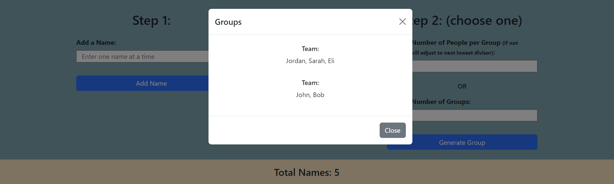

# Random Group Generator

**Name:** Elizabeth Trotter

### Project Scope: 

This was a `single day sprint` challenge where I built out a `random group generator` that allows you to enter names and generate random groups. This was a `desktop build` that utilized `vanilla JavaScript`, `HTML`, and the `Bootstrap Framework`. 

- This challenge was much tougher than yesterday's sprint, but I had the opportunity to learn more about the `Fisher–Yates Shuffle Algorithm`.

- Click :point_right: [here](#desktop-preview) to scroll down to a preview of the task tracking app in action or check the status badge above to view the deployed website.

> [!NOTE]  
> The project focused on functionality first, meeting the client's requirements, and supplying a working product prior to the deadline. There is opportunity to improve the design and responsiveness, if desired. 

Requirements:

- [x] Be able to add names to a list
- [x] Allows to delete a specific name from the list
- [x] Allows user to be able to randomly generate the following
    - How many people per group or
    - How many groups you want to have.
    - This may contain an odd person out scenario. You must make sure there are no groups of one when that happens (Unless it was intentional by the user).
- [x] Make sure it is designed.
- [x] Use creating elements.
- [x] Allow the ability to come back to the page and have the list from the last session there.
- [x] Tested.
- [x] Built in Vanilla JS
- [x] Desktop Build for this application.

### Desktop Preview

Figure 1: Desktop preview of random group generator in action when choosing to create 2 groups

